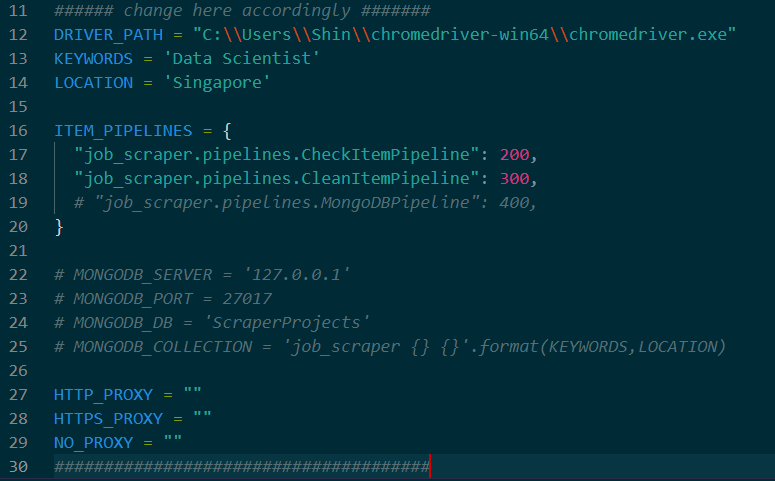

# Job-Scraper
This project is to crawl job portals and scrape job posts for any desired position and location using scrapy and selenium. 

## Table of Contents
- [Installation](#installation)
- [Usage](#usage)
- [Exploratory Data Analysis](#exploratory-data-analysis)
- [Future Project](#future-project)

## Installation
1. Clone the repository:
```bash
 git clone https://github.com/shinthan001/Job-Scraper/tree/main
```

2. Install dependencies:
```bash
 pip install requirements.txt
 ```

3. Download WebDriver and save it in your directory. [Google WebDriver](https://googlechromelabs.github.io/chrome-for-testing/) 

4. Optional: Download and setup [MongoDB](https://www.mongodb.com/try/download/shell).

## Usage

1. In `./job_scraper/job_scraper/spiders/settings.py`, please modify your webdriver path, desired keywords or job and location accordingly. Add proxy settings if needed.

2. If you have set up MongoDB on your local host, please set up server, port, db and collection name.

    
<br />

3. Change directory to `./job_scraper/job_scraper/spiders/` and run spiders.
```bash
 scrapy runspider jobStreet.py
```
```bash
 scrapy runspider careersGov.py
```

4. If you are not using MongoDB, run spider using following command to save data.
```bash
 scrapy runspider jobStreet.py -O yourfile:format
```

## Exploratory Data Analysis

- Primarily, KEYWORDS = 'Data Scientist', LOCATION = 'Singapore' were used to scrape data and basic EDA was conducted here [./Basic EDA.ipynb](Basic%20EDA.ipynb). 
- Quantitative Analysis such as top 20 hiring companies were observed.
- Basic NLP techniques such as lemmatization, text cleaning and n-gram analysis were also experiemented on job descriptions to retrieve common and meaningful key points to job hunters.

## Future Project
- With the use of proper datasets, I'm working on Named Entity Recognition (NER) to extract skills described in job descriptions.